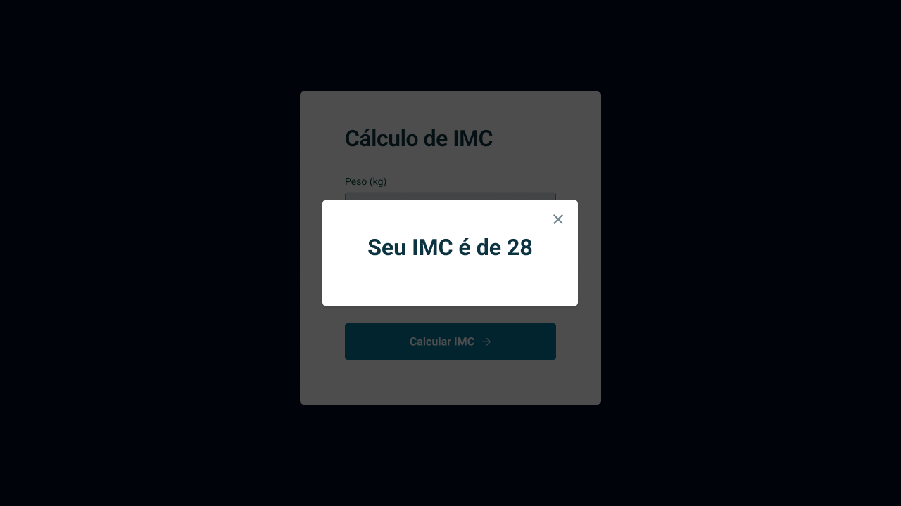
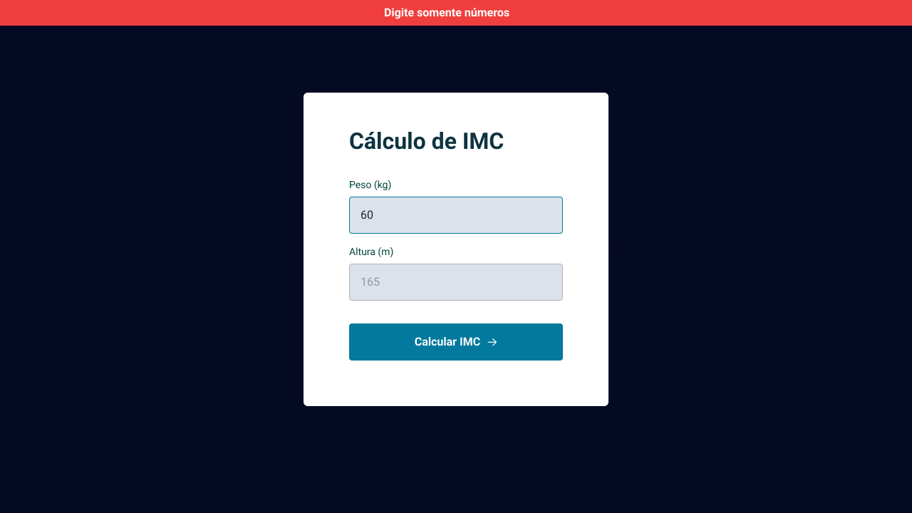

<h1 align="center">IMC 🧮 </h1>

> Trilha Explorer 

Projeto desenvolvido durante o curso Explorer da Rocketseat, dedicado à criação de um aplicativo de cálculo do Índice de Massa Corporal (IMC). O foco foi na implementação de uma aplicação funcional que permitisse aos usuários calcular seu IMC, uma métrica importante para avaliar a relação entre peso e altura. Ao longo do curso, os participantes exploraram práticas de programação, design responsivo e interatividade, aprimorando suas habilidades de desenvolvimento web.
 

[Clique aqui para acessar](https://lubernardino.github.io/IMC/)

### 🧪 Tools

- HTML
- CSS
- JavaScript (ES6 Modules)
- Git e Github